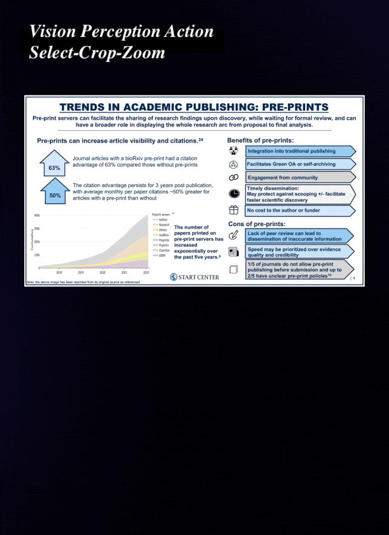
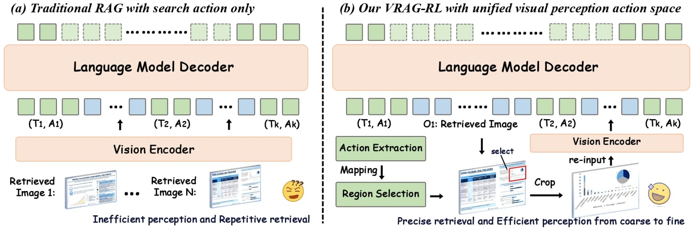
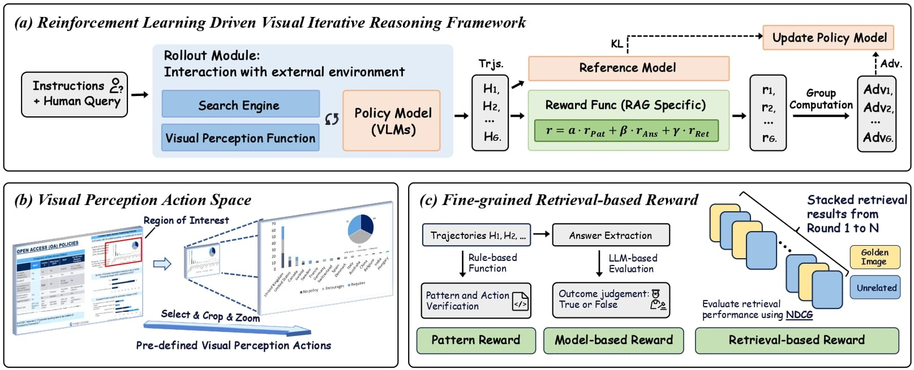

# <div align="center">✨ VRAG-RL: Next-Generation Visual RAG via Multi-Modal Agent Reinforcement Learning</div>

<div align="center">
<p><strong>A Multi-Turn Multi-Modal Agent Training Framework for Visually Rich Information</strong></p>
<a href="https://arxiv.org/pdf/2505.22019" target="_blank"></a>
<a href="https://huggingface.co/autumncc/Qwen2.5-VL-7B-VRAG" target="_blank"></a>
</div>

<div align="center" style="background-color: #f0f0f0; padding: 10px; border-radius: 8px;">
<table style="border-collapse: collapse; margin: 0 auto;">
<tr>
<td style="padding: 5px;"></td>
<td style="padding: 5px;"></td>
<td style="padding: 5px;"></td>
</tr>
</table>
</div>

---

## 🚀 Overview

**VRAG-RL** is a next-generation **Visual Retrieval-Augmented Generation (RAG)** system designed to enable **Vision-Language Models (VLMs)** to reason over **visually rich content**. The framework integrates **multi-turn reinforcement learning** with **multi-modal retrieval**, enabling agents to progressively gather information from coarse-grained overviews to fine-grained details.

Key contributions:

1. **VRAG: Purely Visual RAG Agent**

   * Enables VLMs to interact with visually structured documents.
   * Supports coarse-to-fine information retrieval, improving reasoning accuracy.

2. **VRAG-RL: Multi-Turn Multi-Modal Reinforcement Learning**

   * Trains agents to reason and retrieve effectively from visual content.
   * Supports integration with external tools and extensible multi-agent training.

3. **Training Framework**

   * Multi-turn training pipeline supporting complex reasoning tasks.
   * Extensible to custom datasets and different VLMs.

<div align="center">
<p>
  
</p>
</div>

---

## 🔍 Quick Start

The repository provides a **demo pipeline** for rapid experimentation.

**Step 0: Install Dependencies**

```bash
# Create Python environment
conda create -n vrag python=3.10
conda activate vrag

# Clone repository
git clone https://github.com/alibaba-nlp/VRAG.git
cd VRAG

# Install demo requirements
pip install -r requirements.txt
```

---

### Step 1: Launch the Search Engine

The search engine leverages **Colpali embedding models** to perform visual retrieval. For optimal performance, deploy it independently on a single GPU.

```bash
# Start search engine API server
python search_engine/search_engine_api.py
```

---

### Step 2: Deploy VLM

Use **vLLM** to deploy the Qwen2.5-VL-7B model. A single A100 80G GPU is sufficient for inference.

```bash
vllm serve autumncc/Qwen2.5-VL-7B-VRAG \
  --port 8001 \
  --host 0.0.0.0 \
  --limit-mm-per-prompt image=10 \
  --served-model-name Qwen/Qwen2.5-VL-7B-Instruct
```

---

### Step 3: Launch the Demo

After starting the search engine and VLM service, run the Streamlit demo:

```bash
streamlit run demo/app.py
```

The demo allows querying visually rich documents and receiving generated answers with multi-turn reasoning.

---

## 💻 Build Your Own VRAG System

You can apply VRAG to your own visual corpus using a three-step pipeline:

---

### Step 1: Convert Documents to Images

Store converted `.jpg` images in `search_engine/corpus/img`. Use the provided script:

```bash
python search_engine/corpus/pdf2images.py
```

This prepares the corpus for **purely vision-based retrieval**.

---

### Step 2: Build the Multi-Modal Index Database

VRAG uses **Llama-Index** for embeddings:

```bash
# Test embedding model
python search_engine/vl_embedding.py

# Full ingestion and embedding
python search_engine/ingestion.py
```

This creates **multi-modal embeddings** that combine textual and visual features for efficient retrieval.

---

### Step 3: Run Multi-Modal Retrieval

```python
from search_engine.search_engine import SearchEngine

# Initialize search engine
search_engine = SearchEngine(
    dataset_dir='search_engine/corpus',
    node_dir_prefix='colqwen_ingestion',
    embed_model_name='vidore/colqwen2-v1.0'
)

# Batch search queries
results = search_engine.batch_search(['Query 1', 'Query 2'])
```

To serve the search engine via API:

```bash
python search_engine/search_engine_api.py
```

---

### Step 4: Run VRAG Agent

After deploying VLM and search engine:

```python
from demo.vrag_agent import VRAG

vrag = VRAG(
    base_url='http://0.0.0.0:8001/v1',
    search_url='http://0.0.0.0:8002/search',
    generator=False
)

answer = vrag.run('What is the capital of France?')
print(answer)
```

> Agents can iteratively refine their answers based on retrieved visual information, enabling **coarse-to-fine reasoning**.

---

## ⚙️ VRAG-RL: Training with Multi-Turn Reinforcement Learning

VRAG-RL extends VRAG to a **training framework**, allowing **multi-turn RL training** for agents to learn:

* Visual perception and reasoning.
* Multi-step information retrieval.
* Integration with external tools for reasoning augmentation.

<div align="center">
<p>
  
</p>
</div>

> Training modules and RL scripts will be released soon. This framework is designed to be extensible to different VLMs and custom corpora.

---

## 🙏 Acknowledgements

VRAG-RL builds upon:

* [ViDoRAG](https://github.com/Alibaba-NLP/ViDoRAG) – Multi-agent iterative reasoning.
* [LLaMA-Factory](https://github.com/hiyouga/LLaMA-Factory) – LLM orchestration framework.
* [Search-R1](https://github.com/PeterGriffinJin/Search-R1) – Visual search engine implementations.
* [VERL](https://github.com/volcengine/verl) – Reinforcement learning utilities.

We greatly appreciate the contributions of these projects to the community.

---

## 📝 Citation

```bibtex
@misc{wang2025vragrlempowervisionperceptionbasedrag,
      title={VRAG-RL: Empower Vision-Perception-Based RAG for Visually Rich Information Understanding via Iterative Reasoning with Reinforcement Learning}, 
      author={Qiuchen Wang and Ruixue Ding and Yu Zeng and Zehui Chen and Lin Chen and Shihang Wang and Pengjun Xie and Fei Huang and Feng Zhao},
      year={2025},
      eprint={2505.22019},
      archivePrefix={arXiv},
      primaryClass={cs.CL},
      url={https://arxiv.org/abs/2505.22019}, 
}
```


