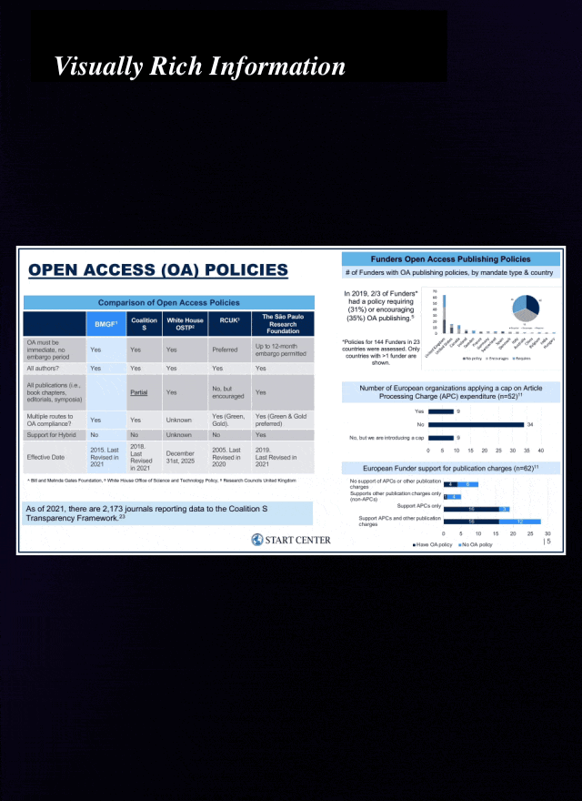

✨ VRAG-RL: Next-Generation Visual RAG via Multi-Modal Agent Reinforcement Learning

 
<strong>A Multi-Turn Multi-Modal Agent Training Framework for Visually Rich Information</strong>
   
 
 <table style="border-collapse: collapse; margin: 0 auto;"> <tr> <td style="padding: 5px;"></td> <td style="padding: 5px;"></td> <td style="padding: 5px;"></td> </tr> </table> 

  
  

  
    
      
        
      
      
        
      
      
        
      
    
  

📖 Table of Contents

Introduction
Key Features
Quick Start
Dependencies
Running the VRAG Demo

Building Your Own VRAG
Step 1: Prepare Your Corpus
Step 2: Build the Index Database
Step 3: Run the Multi-Modal Retriever
Step 4: Deploy and Run VRAG

Training with VRAG-RL
Training Dependencies
Training Steps

Acknowledgements
Citation
Related Projects
License

📜 Introduction
VRAG-RL is a pioneering framework designed to enhance Vision-Language Models (VLMs) for processing visually rich information through a novel reinforcement learning (RL) approach. By introducing VRAG (Visual Retrieval-Augmented Generation), this framework enables VLMs to perform progressive information gathering, moving from coarse-grained to fine-grained perspectives. VRAG-RL leverages a multi-turn, multi-modal training paradigm to empower VLMs with robust reasoning, retrieval, and comprehension capabilities for visually complex data.
Key Components

VRAG: A purely vision-based Retrieval-Augmented Generation agent that retrieves and processes visual information iteratively.
VRAG-RL: A reinforcement learning framework tailored for training VLMs to reason and retrieve visual data effectively.
Extensible Framework: Supports integration with various tools and models, enabling flexible customization for diverse use cases.

  

🌟 Key Features

Purely Visual RAG: Enables VLMs to retrieve and process visually rich data without relying on text-based inputs.
Multi-Turn Reasoning: Supports iterative reasoning across multiple turns, enhancing the model's ability to refine its understanding.
Reinforcement Learning Integration: Utilizes RL to optimize VLM performance in retrieval and reasoning tasks.
Scalable and Extensible: Designed to integrate with various tools and datasets, making it adaptable for custom applications.
Open-Source Resources: Includes a pre-trained model (Qwen2.5-VL-7B-VRAG) and a comprehensive training framework.

🚀 Quick Start
This section guides you through setting up and running the VRAG demo using the provided example data.
Dependencies
To set up the environment and install dependencies, follow these steps:
# Create a new Conda environment
conda create -n vrag python=3.10
conda activate vrag

# Clone the VRAG repository
git clone https://github.com/alibaba-nlp/VRAG.git
cd VRAG

# Install dependencies for the demo
pip install -r requirements.txt

Running the VRAG Demo

Launch the Search EngineThe search engine uses the Colpali embedding model family and should be deployed on a single GPU for optimal performance.
python search_engine/search_engine_api.py

Deploy the VLM ServerDownload the Qwen2.5-VL-7B-VRAG model and deploy it using vLLM. A single A100 80G GPU is sufficient for a 7B model.
vllm serve autumncc/Qwen2.5-VL-7B-VRAG --port 8001 --host 0.0.0.0 --limit-mm-per-prompt image=10 --served-model-name Qwen/Qwen2.5-VL-7B-Instruct

Launch the DemoUse Streamlit to run the interactive demo.
streamlit run demo/app.py

For a one-step setup, refer to the run_demo.sh script included in the repository.
🛠️ Building Your Own VRAG
To deploy VRAG on your own dataset, follow these steps to build a vision-based search engine and integrate it with the VRAG framework.
Step 1: Prepare Your Corpus
Convert your documents to .jpg format and store them in the search_engine/corpus/img directory using the provided script.
python search_engine/corpus/pdf2images.py

Step 2: Build the Index Database
VRAG uses the Llama-Index framework for indexing. Preprocess your corpus and create an index database for efficient retrieval.

Test the Embedding ModelVerify that the embedding model loads correctly before processing the entire dataset.
python ./search_engine/vl_embedding.py

Ingest and Embed the DatasetRun the ingestion script to embed your corpus into the index database.
python ./search_engine/ingestion.py

Step 3: Run the Multi-Modal Retriever
Set up and test the search engine using the Colpali embedding model.
from search_engine.search_engine import SearchEngine

# Initialize the search engine
search_engine = SearchEngine(
    dataset_dir='search_engine/corpus',
    node_dir_prefix='colqwen_ingestion',
    embed_model_name='vidore/colqwen2-v1.0'
)

# Perform a batch search
recall_results = search_engine.batch_search(['query A', 'query B'])

Once the search engine is ready, deploy it as an API server.
python search_engine/search_engine_api.py

Step 4: Deploy and Run VRAG
Deploy the VLM server and run the VRAG demo as described in the Quick Start section.
Alternatively, integrate VRAG into your own application using the provided agent script:
from vrag_agent import VRAG

# Initialize the VRAG agent
vrag = VRAG(
    base_url='http://0.0.0.0:8001/v1',
    search_url='http://0.0.0.0:8002/search',
    generator=False
)

# Run a query
answer = vrag.run('What is the capital of France?')

🧠 Training with VRAG-RL

  

The VRAG-RL training framework will be released soon. Below is a placeholder for the training setup and steps.
Training Dependencies
cd VRAG-RL
# Install training dependencies
pip install -r requirements.txt
# Install VRAG-RL package
pip install -e .

Training Steps

Prepare Training DataDetails on preparing the training corpus will be provided upon release.

Build Training Corpus & Search EngineInstructions for setting up the multi-modal search engine for training will be included.

Run RL TrainingSteps for training the Qwen2.5-VL-Instruct model with VRAG-RL will be detailed.

Stay tuned for updates on the training framework release!
🙏 Acknowledgements
VRAG-RL builds upon the following open-source projects, and we express our gratitude for their contributions:

ViDoRAG
LLaMA-Factory
Search-R1
verl

📝 Citation
If you use VRAG-RL in your research, please cite the following paper:
@misc{wang2025vragrlempowervisionperceptionbasedrag,
  title={VRAG-RL: Empower Vision-Perception-Based RAG for Visually Rich Information Understanding via Iterative Reasoning with Reinforcement Learning},
  author={Qiuchen Wang and Ruixue Ding and Yu Zeng and Zehui Chen and Lin Chen and Shihang Wang and Pengjun Xie and Fei Huang and Feng Zhao},
  year={2025},
  eprint={2505.22019},
  archivePrefix={arXiv},
  primaryClass={cs.CL},
  url={https://arxiv.org/abs/2505.22019},
}

🌐 Related Projects
Explore our related work on Visual Retrieval-Augmented Generation:

ViDoRAG: A novel RAG framework utilizing a multi-agent, actor-critic paradigm for iterative reasoning. Code available at https://github.com/hiteshjha2003/ViDoRAG

📜 License
This project is licensed under the Apache License 2.0. See the LICENSE file for more details.
